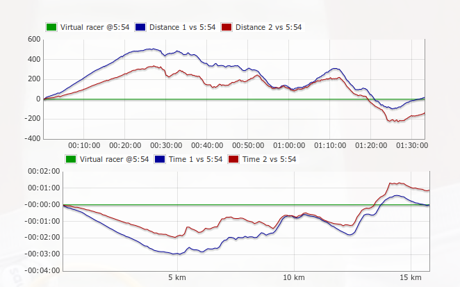

Compare one or more running activities to constant pace virtual racer.

`activity-compare.php?activityIDs=123,134&vRacerPace=4:30&adjustDistance=no`

`activityIDs` - comma separated list of activity IDs

`vRacerPace` - virtual racer pace in min/km, defaults to average pace of first activity

`adjustDistance` - usually GPS receivers will show longer distance than official, this will adjust the distance proportionally, defaults to yes

Charts will show how many meters or seconds the activity is ahead or behind virtual racer.

